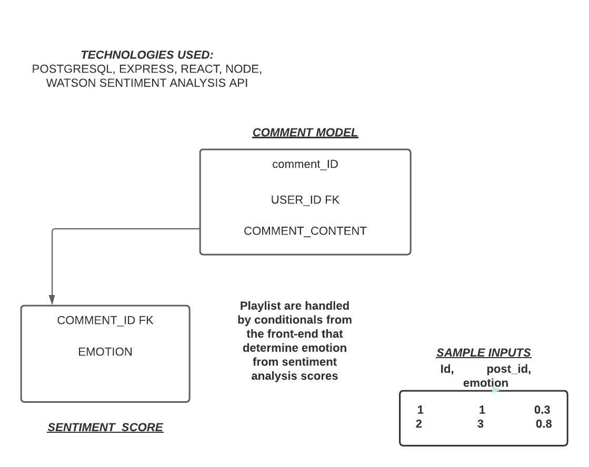

# Apollo

## What is Apollo
Named after the Olympian God of music, Apollo takes an input and curates a playlist based off the mood of your input. To use Apollo simply write a brief paragraph about how you're feeling. Apollo will then analyze the tone of your paragraph and provide you with a Spotify playlist. From there, you will sign into your Spotify account to listen to the playlist.

## Technologies used
This was created using the PERN stack 

## Installation 

## User Stories
    -As a user I want to be abel to login using my Spotify credentials
    -As a user I want a playlist created based off the tone of my input 
    -I want to be able to open the playlist in spotify so I may save it
    -As a user I want to be abel to make multiple input submissions
## Wireframes
    
    

## Entity Relationship Diagrams
    

## Unsolved Problems and future updates
    -Unfortunately I have been having state issue which  isn't allowing the frontend to display the playlist
    -I would like to add a tone attribute to the comment model so I could fetch the API on the backend instead
    -I would love to use twitter API to take recent tweets as an input instead of using a form on the site